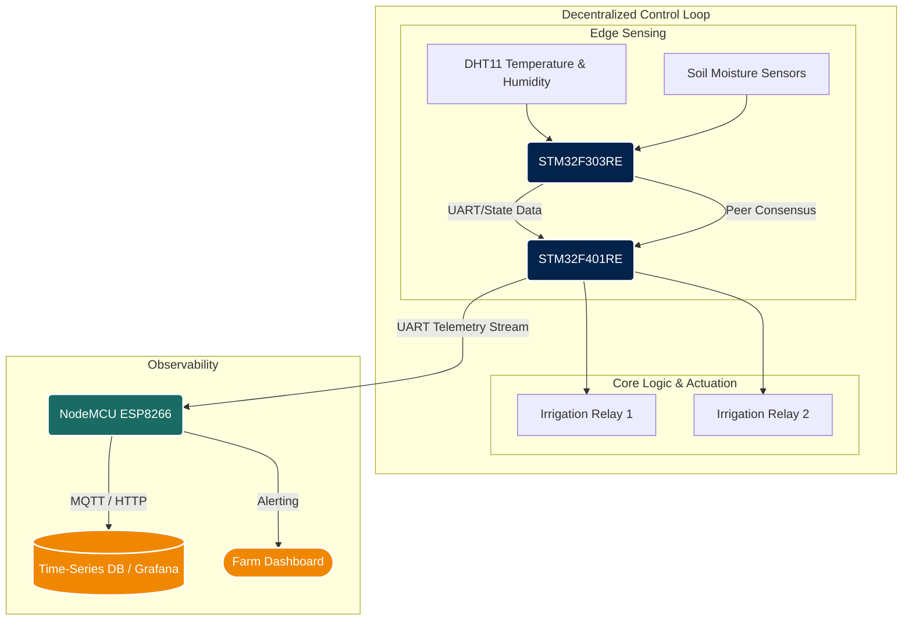

# 📐 System Architecture

The **Sugarcane IoT** project utilizes a multi-tier, distributed hardware architecture designed for maximum reliability in agricultural environments. Instead of relying on a single centralized cloud server to make critical irrigation decisions, the intelligence is pushed to the edge. 

This document outlines the topology, data flow, and consensus mechanisms driving the system.

---

## 🏗️ High-Level Topology

The system is composed of three primary node types working in tandem:

1. **Edge Sensing Nodes (STM32F303RE):** Interfaced directly with the physical environment. They sample high-fidelity analog and digital signals from DHT11 sensors, moisture probes, and water level indicators.
2. **Core Logic Nodes (STM32F401RE):** The brain of the local mesh. This node runs the consensus protocol, aggregates telemetry from the Edge Sensing nodes, and directly actuates the water pumps/relays based on local peer-to-peer agreement.
3. **Telemetry Gateway (NodeMCU / ESP8266):** An asynchronous bridge. It listens passively to the consensus decisions and state changes on the UART bus, formats them into JSON, and securely transmits them over Wi-Fi to a time-series database (e.g., Prometheus/Grafana).

### Architecture Diagram



---

## ⚙️ The Novelty: Decentralized Consensus Protocol

Unlike traditional IoT systems where a cloud server dictates when to open a water valve, **Sugarcane IoT** utilizes a **Decentralized Irrigation Consensus**. Because agricultural fields are subject to harsh conditions (rodents cutting wires, power dips, sensor degradation, lost Wi-Fi), relying on a central server is a critical point of failure.

In our protocol:

1. **State Broadcasting:** Nodes continuously broadcast their local state matrix (containing their sensor readings and proposed actuator state).
2. **Validation:** Before `Node B` activates a relay, it cross-references its own logical state with the state broadcasted by `Node A`. 
3. **Fault-Tolerant Fallback:** If `Node A` goes offline (communication timeout), `Node B` seamlessly degrades to an autonomous mode, relying solely on its local heuristics until the mesh heals. 

## 📡 Data Pipeline & Telemetry Formatting

The communication between the STM32 nodes and the NodeMCU gateway happens over a robust UART connection running at `115200` baud.

Data is passed using a highly compressed, easy-to-parse string payload.

**Example Payload:**
```text
303=[TEMP:24,HUM:53,W1:1190,W2:606] 401[T=24,H=54,S1=0,S2=770]
```

### Flow Breakdown:
1. **STM32 Mesh:** `Node A` and `Node B` synchronize their data arrays.
2. **Export:** `Node B` prints the finalized string payload over UART (`TX`).
3. **Capture:** NodeMCU receives the payload on `D7 (GPIO13)` using `SoftwareSerial`.
4. **Publish:** The NodeMCU processes the raw text, wraps it in JSON payloads, and pushes it up to the ingestion pipeline.

---

<div align="center">
  <i>Robust. Scalable. Decentralized.</i>
</div>
